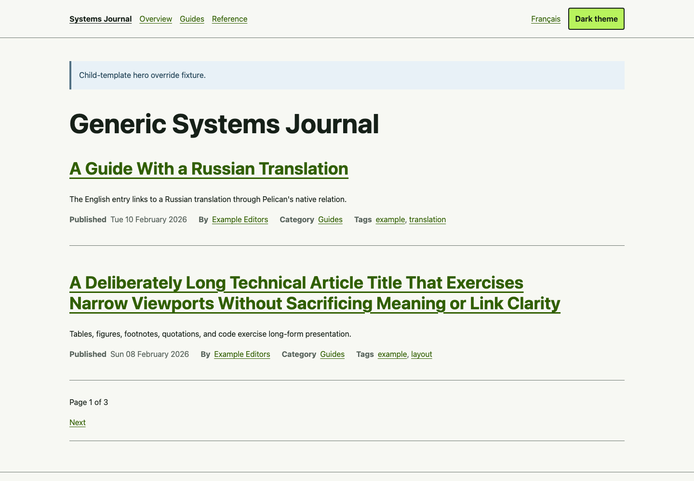
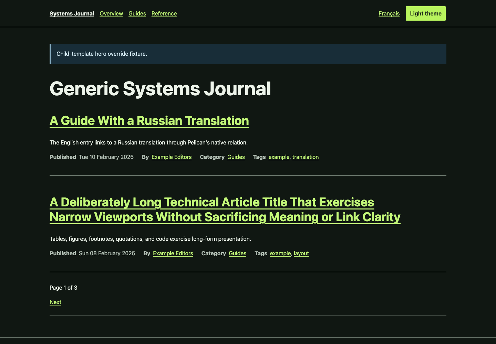
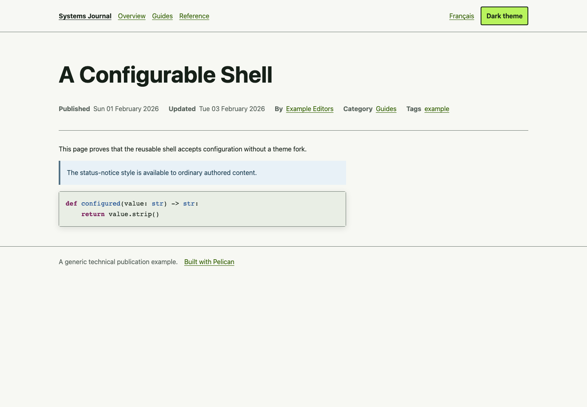
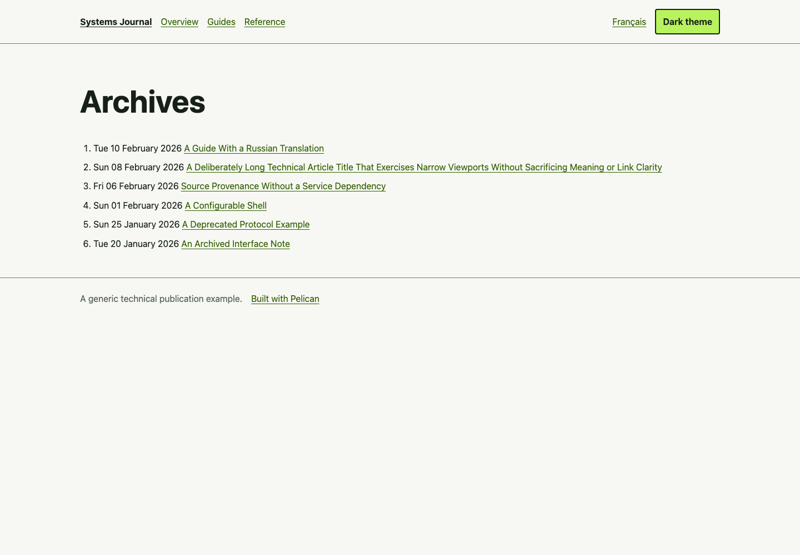
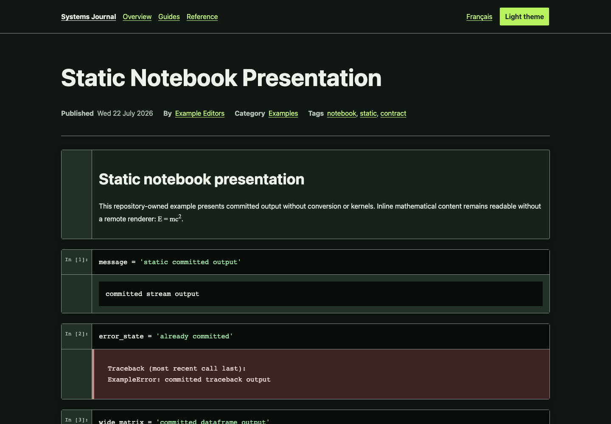

# pelican-engineering-theme

> Release status: `0.1.0` is the first public package release. Its GitHub tag,
> release assets, and PyPI files are produced from one reviewed commit by the
> protected OIDC publication workflow. This package does not deploy or change
> any consuming site.

A reusable, accessibility-conscious Pelican theme for technical writers who
publish long-form articles, code, and trusted static notebook output. The
theme is intentionally generic: it contains no publisher-specific content,
analytics, remote fonts, runtime services, or notebook execution.

## Quick start

Prerequisite: Python 3.11-3.13. Create an isolated environment and install the
exact first release:

```sh
python -m venv .quickstart-venv
.quickstart-venv/bin/python -m pip install \
  pelican-engineering-theme==0.1.0
mkdir -p quickstart/content
```

Create these two files exactly as shown.

<!-- quickstart-file: pelicanconf.py -->
```python
from pelican_engineering_theme import get_theme_path

AUTHOR = "Example Editor"
DEFAULT_LANG = "en"
PATH = "content"
SITENAME = "Engineering Notes"
SITEURL = ""
THEME = str(get_theme_path())
TIMEZONE = "UTC"
RELATIVE_URLS = True
FEED_ALL_ATOM = None
CATEGORY_FEED_ATOM = None
TRANSLATION_FEED_ATOM = None
AUTHOR_FEED_ATOM = None
AUTHOR_FEED_RSS = None
```

<!-- quickstart-file: content/hello.md -->
```markdown
Title: A small technical note
Date: 2026-07-22
Category: Notes
Tags: example
Slug: small-technical-note
Summary: A generic page built with the installed theme package.

# A verifiable first build

This content is intentionally generic and local.
```

Build outside the repository checkout:

```sh
cd quickstart
../.quickstart-venv/bin/python -I -m pelican content \
  -s pelicanconf.py -o output
test -f output/small-technical-note.html
test -f output/theme/css/scaffold.css
```

The package test suite extracts the two marked file blocks from this README,
installs the exact wheel or sdist in a new environment, and performs this build
away from the checkout. The public release workflow separately proves that the
GitHub and PyPI files have the same reviewed hashes.

## Representative example

These committed captures come only from `examples/full`, the first-party theme
source, and a local Chromium session. Their routes, themes, viewports, input
tree digest, byte sizes, and SHA-256 hashes are fail-closed in
[screenshot provenance](docs/screenshots/README.md).

| Surface | Capture |
| --- | --- |
| Light home |  |
| Dark home |  |
| Article |  |
| Archive |  |
| Notebook |  |

Screenshots are technical example evidence, not acceptance of a consuming
site's visual design.

## What the package owns

- one semantic Pelican document shell and all standard content/taxonomy pages;
- an unconditional light first visit and an explicit persisted dark choice;
- 18 documented Jinja extension blocks and public `--pet-*` CSS tokens;
- canonical, feed-discovery, social metadata, and opt-in structured-data hooks;
- responsive, print-safe presentation of the frozen
  `nbconvert-basic.v1` notebook HTML contract;
- a generic packaged `404.html` and minimal/full examples.

The theme owns presentation only. A reader owns `.ipynb` conversion and
normalized notebook metadata. A consuming site owns content, routes,
configuration, dependency pins, deployment, and the trust policy for rich
output. The theme never imports a notebook reader, parses or executes a
notebook, starts a kernel, or grants trust to content.

## Compatibility

The candidate declares and tests every combination of Python 3.11, 3.12, and
3.13 with Pelican 4.11 and 4.12. The dependency range is
`pelican[markdown]>=4.11,<4.13`. Output is ordinary static HTML/CSS/JavaScript
for GitHub Pages or another static host. See the complete
[compatibility matrix](docs/compatibility.md), including what is not claimed.

## Documentation

- [Configuration reference](docs/configuration.md)
- [Customization guide](docs/customization.md) and
  [versioned customization contract](docs/contracts/customization-v1.md)
- [Notebook guide](docs/notebooks.md) and
  [notebook HTML contract](docs/contracts/notebook-html-v1.md)
- [Accessibility statement](docs/accessibility.md)
- [Compatibility matrix](docs/compatibility.md)
- [Version policy](docs/versioning.md)
- [Dependency-update policy](docs/dependency-updates.md)
- [Example deployment](docs/deployment.md)
- [Release process](docs/releasing.md) and
  [`0.1.0` candidate notes](docs/release-notes/0.1.0.md)
- [Contributing](CONTRIBUTING.md), [security policy](SECURITY.md), and
  [third-party/asset policy](docs/third-party-and-assets.md)

## Development and validation

```sh
uv sync --locked --all-groups
uv run --locked --all-groups pytest
uv run --locked --all-groups ruff check .
uv run --locked --all-groups mypy
uv run --locked --all-groups python scripts/validate_foundation.py
uv run --locked --all-groups python scripts/validate_docs.py
uv run --locked --all-groups python scripts/validate_release_policy.py
```

Real-browser acceptance is intentionally isolated from the six-cell
Python/Pelican matrix:

```sh
npm ci --ignore-scripts
uv run --locked --all-groups playwright install chromium
PET_RUN_BROWSER=1 uv run --locked --all-groups \
  pytest -m browser tests/test_browser_acceptance.py
```

That suite retains keyboard, focus, responsive overflow, axe-core, first-paint,
print, notebook, exact-head, screenshot-manifest, and zero-external-request
evidence. Automation is executor evidence and does not replace human review.

## Candidate and publication boundary

`scripts/release_candidate.py` builds the wheel and sdist twice with the Git
commit timestamp as `SOURCE_DATE_EPOCH`, rejects byte drift, records exact
source SHA and SHA-256 provenance, and labels both artifacts as candidates.
The release workflow cannot run on a push or pull request. It requires a
separately published GitHub Release/tag and protected `github-release` and
`pypi` environments; Trusted Publishing uses OIDC and no stored PyPI token.

`0.1.0` is a pre-1.0 contract: documented settings, blocks, tokens, and
notebook markup are versioned, but broader API stability is not claimed. Read
[the version policy](docs/versioning.md) before depending on an override.

## License and provenance

The project is MIT-licensed and implemented from scratch under the recorded
no-copy boundary. The exact identity, responsibility, and stable-contract
decisions are in [ADR 0001](docs/decisions/0001-identity-license-and-boundaries.md).
The external notebook fixture is source/test evidence with its own recorded
Apache-2.0 and BSD-3-Clause provenance; it is not in the runtime wheel.
